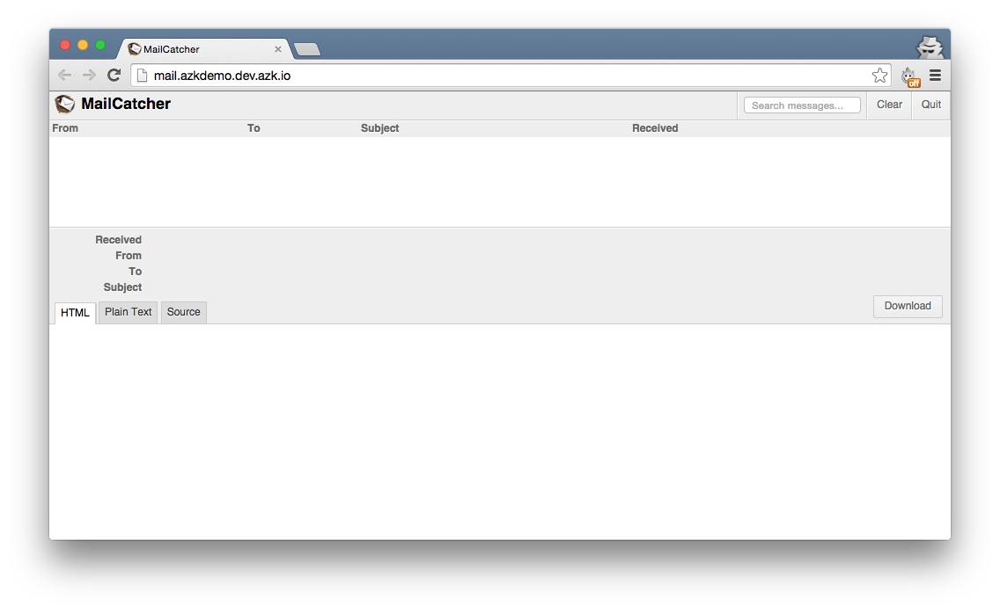
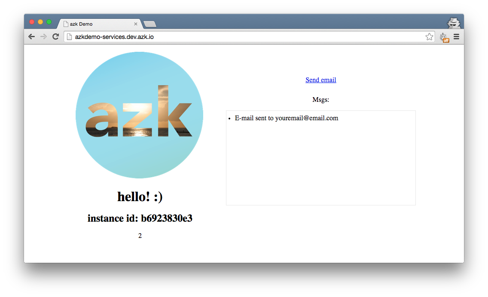

# MailCatcher


> Screenshot from [MailCatcher's GitHub page](https://github.com/sj26/mailcatcher/)

MailCatcher is an open-source project that runs an SMTP server that catches any message sent to it, and displays it in a nice web interface. If you noticed we already have a "Send email" link that we can click, but it does nothing. What we'll do is add a method that when that button is clicked, will send out an email that will go to MailCatcher, and then we can easily inspect it afterwards.

Let's start by adding our MailCatcher system to the Azkfile.js. Open it and under the `redis` system add the following:

```javascript
redis: {
  ...
}

// MailCatcher system
mail: {
    // Dependent systems
    depends: [],
    // More images:  http://images.azk.io
    image: {"docker": "schickling/mailcatcher"},
    http: {
      domains: [
        "#{system.name}.azkdemo.#{azk.default_domain}",
      ],
    },
    ports: {
      // exports global variables
      http: "1080/tcp",
      smtp: "1025/tcp",
    },
  },
```

Now let's run the mail system and check that it's working:

```
$ azk start mail
```

You should see the following output:

```
┌───┬─────────────────────┬───────────┬────────────────────────────────────┬────────────────────────────┬──────────────┐
│   │ System              │ Instances │ Hostname/url                       │ Instances-Ports            │ Provisioned  │
├───┼─────────────────────┼───────────┼────────────────────────────────────┼────────────────────────────┼──────────────┤
│ ↑ │ mail                │ 1         │ http://mail.azkdemo.dev.azk.io     │ 1-smtp:49358, 1-http:49357 │ -            │
├───┼─────────────────────┼───────────┼────────────────────────────────────┼────────────────────────────┼──────────────┤
│ ↑ │ redis               │ 1         │ dev.azk.io                         │ 1-6379:49351               │ -            │
├───┴─────────────────────┴───────────┴────────────────────────────────────┴────────────────────────────┴──────────────┤
│ ↑ │ azkdemo-services    │ 1         │ http://azkdemo-services.dev.azk.io │ 1-http:49352               │ -            │
└───┴─────────────────────┴───────────┴────────────────────────────────────┴────────────────────────────┴──────────────┘
```

Now open the `mail` system URL: http://mail.azkdemo.dev.azk.io and you should see MailCatcher's interface:



Our next step will be adding the email sending functionality to our app. Open the file `src/index.js`. We already created a `get` route for the `/mail` endpoint, so let's use that. Instead of writing everything inside that function, let's create a new file called `send_email.js` inside the `src` folder.

```
$ touch src/send_email.js
```

Open it and add the following to it:

```javascript
var transporter = null;

if (process.env.MAIL_SMTP_HOST) {
  var nodemailer = require('nodemailer');
  var smtpTransport = require('nodemailer-smtp-transport');

  transporter = nodemailer.createTransport(smtpTransport({
    host: process.env.MAIL_SMTP_HOST,
    port: process.env.MAIL_SMTP_PORT,
    ignoreTLS: true
  }));
}

module.exports = function(req, response) {
  if (transporter) {
    var mail = {
      from: 'youremail@email.com',
      to: 'youremail@email.com',
      subject: 'test',
      text: 'hello world!!!!'
    };

    transporter.sendMail(mail, function(err, mailResult) {
      var msg = 'E-mail sent to ' + mail.from;
      response.end(msg);
    });
  } else {
    response.end('mail not active, try azk start mail');
    console.log('transporter:', transporter);
    console.log('process.env.MAIL_SMTP_HOST:', process.env.MAIL_SMTP_HOST);
    console.log('process.env.MAIL_SMTP_PORT:', process.env.MAIL_SMTP_PORT);
  }
}
```

We'll use the [nodemailer](https://github.com/andris9/Nodemailer) and the [nodemailer-smtp-transport](https://github.com/andris9/nodemailer-smtp-transport) modules to send an email to our MailCatcher SMTP server. Now head back to `src/index.js` and change the `/mail` route to the following:

```javascript
// Send mail
app.get('/mail', require('./send_email.js'));
```

Our route is now ready to send out an email. Now let's link the "Send email" text to the `/mail` route. Open the `views/home/index.ejs` file and the following `script` right under the `jquery` script tag:

```html
    <script>
      var ajaxUrl = "/mail";
      $(document).ready(function() {
        $('#btn_send').on('click', function(e){
          $.get(ajaxUrl, function(result){
            $('#emails_received').append('<li>' + result + "</li>");
          });
          e.preventDefault();
        });

        var socket = io.connect();
        socket.on('msgs', function(data) {
          console.log(data);
          $('#emails_received').append("<li>ngrok: " + data + "</li>");
        });
      });
    </script>
```

Okay, so now everything is almost ready! We just need one last step to make everything come together. You might have noticed that in our `src/send_email.js` file we have two environment variables, `process.env.MAIL_SMTP_HOST` and `process.env.MAIL_SMTP_PORT`. Those two variables come from the `mail` system, so we need to add it to our `node` system `depends` so they can be available as well. Open your `Azkfile.js` and inside the `azkdemo-services` `depends` parameter add:

```javascript
'azkdemo-services': {
    // Dependent systems
    depends: ["mail", "redis"],
    ...
  },
  ...
}
```

We're all set up now! Let's test it out, run:

```
$ azk restart
```

Now open the URL for our Node.js application and click "Send email": http://azkdemo-services.dev.azk.io you should see:



And if you open the URL for our MailCatcher application, you should be able to see our email and its contents: http://mail.azkdemo.dev.azk.io


And that's it! In the next section we'll cover how to add `ngrok` to your application so you can test webhooks. :)
