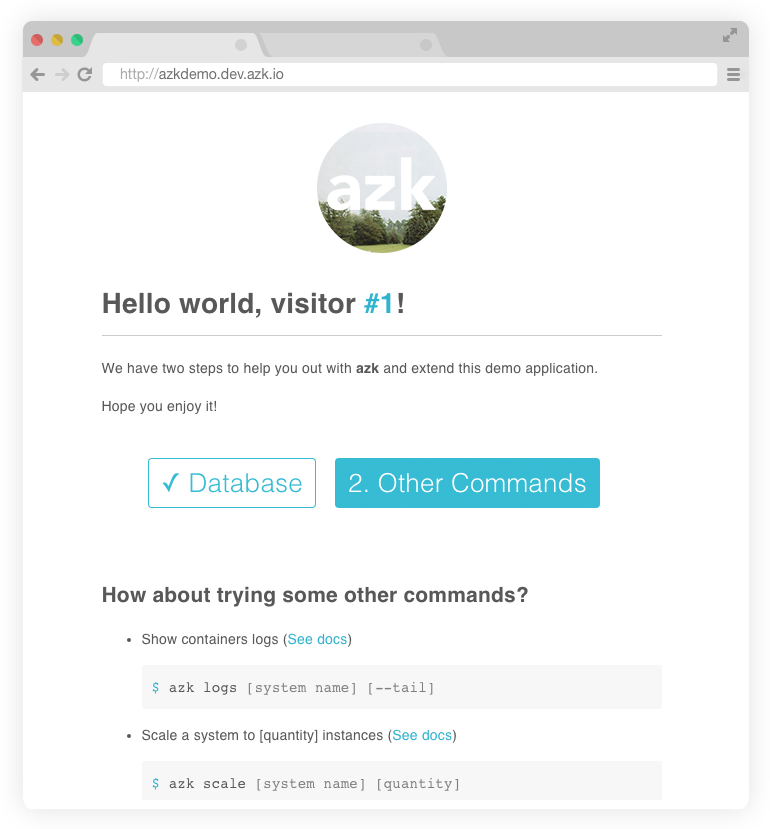

# Databases

Our demo application shows a simple visit counter, but, before that, you need to set up a database where the application can save this visit count.

Installing and configuring a database in `azk` is very simple. First you must edit the `Azkfile.js` file and add a new entry in `systems` referring to the database. In this case we will use __redis__:

!INCLUDE "../../common/getting-started/add_database.md"

Once this is done it's possible to start the new system and have access to the database:

```bash
$ azk start redis
```

The output of the command above should look something like this:


# Configuring application

For our sample application to be able to connect to the database we must first **install the library** connection to the database.

We must remember, in `azk` the installation of dependencies is always done in an "**isolated environment**", so we'll call the **shell** of `azk` for installation:

```bash
$ azk shell azkdemo

[ root@3848e1df91cf:/azk/azkdemo ]$ npm install redis --save
npm WARN package.json azk-hello@0.0.1 No repository field.
redis@0.12.1 node_modules/redis

[ root@3848e1df91cf:/azk/azkdemo ]$ exit
```

# Connecting systems

Once the database is already installed and we have the necessary dependencies to access it, we can configure our application that relies on the database. This will cause the `redis` system to start before the `azkdemo` application. Edit `Azkfile.js`:

```js
// Adds the systems that shape your system
systems({
  azkdemo: {
    // Dependent systems
    depends: ["redis"], // <= adicione o redis
    // ...
  },
  redis: {
    // ...
  }
});
```

Now we just restart the `azkdemo` system and the counter should appear:

```bash
$ azk restart azkdemo
```

Accessing [http://azkdemo.dev.azk.io](http://azkdemo.dev.azk.io) you will see:


