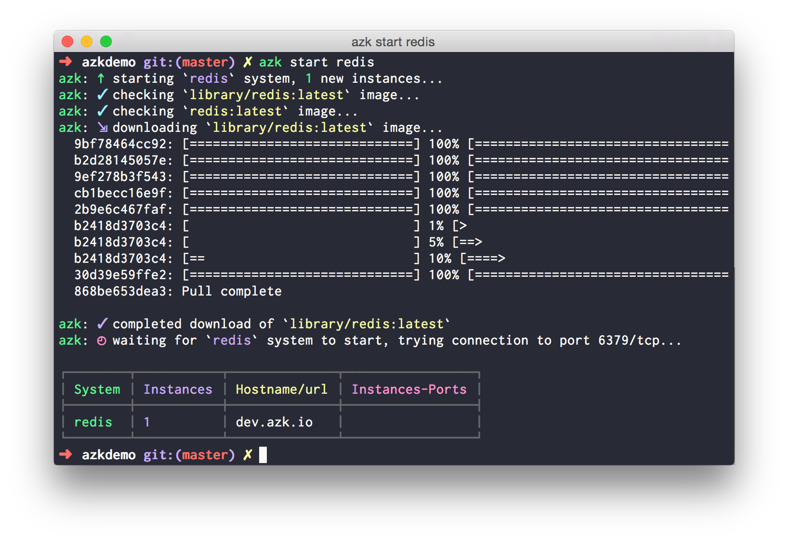
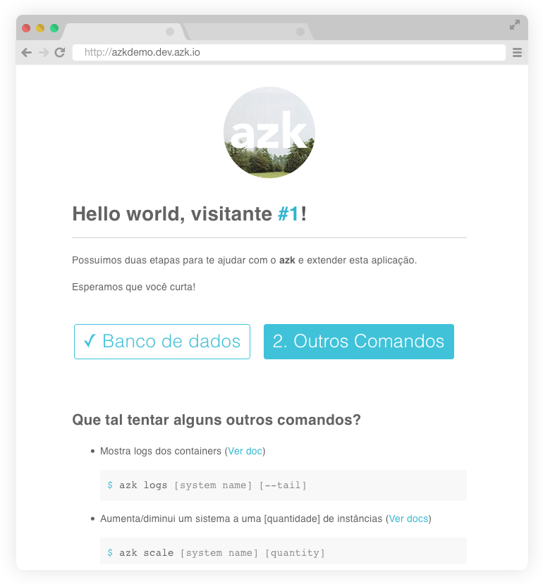

# Bancos de dados

Nossa aplicação de demonstração mostra um simples contador de visitas, porém, antes disso, será preciso configurar um banco de dados onde a aplicação poderá salvar essa contagem de visitas.

Instalar e configurar um banco de dados no `azk` é muito simples. Primeiro você deve editar o arquivo `Azkfile.js` e adicionar uma nova entrada em `systems` referente ao banco de dados. Nesse caso vamos utilizar o __redis__:

!INCLUDE "../../common/getting-started/add_database.md"

Feito isso já é possível levantar o novo sistema e ter acesso ao banco de dados:

```bash
$ azk start redis
```

A saída do comando acima deve ser algo parecido com isso:



# Configurando aplicação

Para que nossa aplicação de exemplo consiga se conectar ao banco de dados precisamos primeiro **instalar a biblioteca** de conexão ao banco de dados.

Devemos lembrar, no `azk` a instalação de dependências é sempre feita em um "**ambiente isolado**", por isso vamos chamar o **shell** do `azk` para fazer a instalação:

```bash
$ azk shell azkdemo

[ root@3848e1df91cf:/azk/azkdemo ]$ npm install redis --save
npm WARN package.json azk-hello@0.0.1 No repository field.
redis@0.12.1 node_modules/redis

[ root@3848e1df91cf:/azk/azkdemo ]$ exit
```

# Conectando os sistemas

Uma vez que o banco de dados já esta instalado e já temos as dependências necessárias para acessá-lo, podemos configurar nossa aplicação para que dependa do banco de dados. Isso irá fazer com que o sistema `redis` seja iniciado antes da aplicação `azkdemo`. Edite o `Azkfile.js`:

```js
// Adds the systems that shape your system
systems({
  azkdemo: {
    // Dependent systems
    depends: ["redis"], // <= adicione o redis
    // ...
  },
  redis: {
    // ...
  }
});
```

Pronto, agora basta reiniciar o sistema `azkdemo` e o contador deverá aparecer:

```bash
$ azk restart azkdemo
```

Acessando [http://azkdemo.dev.azk.io](http://azkdemo.dev.azk.io), você verá:


